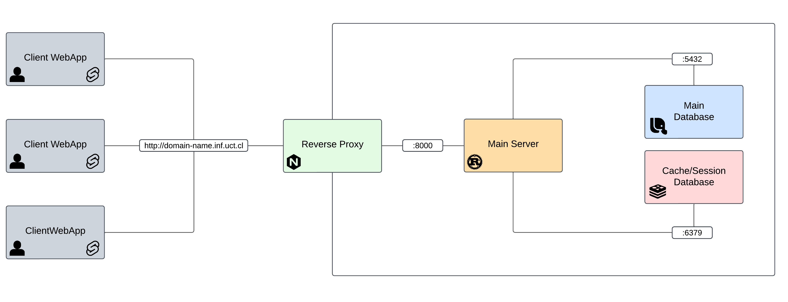

# Sistema de gestión de prácticas y tesis universitarias

Este repositorio contiene el código fuente de un sistema de gestión de prácticas y tesis universitarias. El sistema está diseñado para facilitar la administración de las prácticas y tesis de los estudiantes, permitiendo a los administradores gestionar las solicitudes, asignaciones y seguimientos de manera eficiente.

[Descripción detallada del sistema](REQUIREMENTS.md)

## Diagramas del sistema

### Arquitectura del sistema


### Entidad relación (ERD)


## Instalación y ejecución

Para instalar y ejecutar el sistema, sigue estos pasos de ahora:

1. Clona el repositorio:
   ```bash
   git clone
   ```

2. Instala docker y docker compose.

3. Navega al directorio del proyecto:
   ```bash
   cd INF-MGR/
   ```
4. Crea una copia del archivo `.env.example` y renómbralo a `.env`:
   ```bash
   cp .env.example .env
   ```
   Asegúrate de configurar las variables de entorno en el archivo `.env` según tus necesidades y preferencias.

5. Construye y levanta los contenedores:
   ```bash
    docker compose up
    ```

6. Accede al sistema a través de tu navegador en `http://localhost/`.

### Configuración del entorno de desarrollo

Para configurar el entorno de desarrollo, asegúrate de tener instaladas las siguientes herramientas:

- Node.js LTS [https://nodejs.org/en](https://nodejs.org/en)
- Docker y Docker Compose [https://docs.docker.com/engine/install/](https://docs.docker.com/engine/install/)
- Rust 1.88 [https://www.rust-lang.org/tools/install](https://www.rust-lang.org/tools/install)
- Just [https://github.com/casey/just](https://github.com/casey/just)

- Instalar dependencias locales de Node.js:
   ```bash
   cd ruta-al-repositorio/ && just install
   ```

4. Crea una copia del archivo `.env.example` y renómbralo a `.env`:
   ```bash
   cp .env.example .env
   ```
   Asegúrate de configurar las variables de entorno en el archivo `.env` según tus necesidades.
